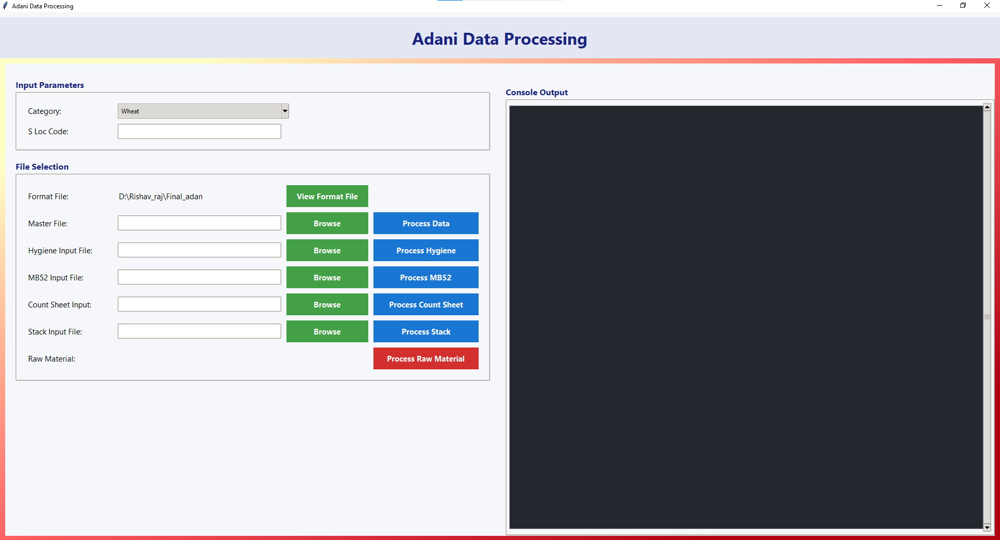

# 🌾 Adani Data Processing Suite

[](https://www.python.org/) 
[](#) 
[](#)



A comprehensive GUI application for processing Adani operations data across multiple formats.

## 📌 Table of Contents
1. [Overview](#overview)
2. [📁 Project Structure](#project-structure)
3. [✨ Features](#features)
4. [_SETUP](#setup)
5. [📥 Input Requirements](#input-requirements)
6. [🖥️ Usage Guide](#usage-guide)
7. [🪛 Maintainers](#maintainers)
8. [🚨 Support Policy](#support-policy)

## 🧾 Overview
The Adani Data Processing Suite offers a feature-rich graphical interface for handling diverse data processing needs across Adani operations. The application supports six distinct data processing workflows with consistent formatting and output standards.

Key Technologies:  
Python | Tkinter | Pandas | OpenPyXL

## 📁 Project Structure
```bash
├── app_mb52.py           # Core processing engine
├── gui.py                # Main GUI interface
├── requirements.txt      # Dependency declarations
├── input/                # Sample input templates
│   ├── countsheet_input_files/
│   └── hygeine_input_files/
└── output/               # Processed output files
```

## ✨ Features
- Multiple processing modes for varied data types
- Integrated file validation and error handling
- Unified output format template
- Console logging and status tracking
- Support for both Wheat and Paddy/Rice categories
- Interactive file selection interface

## 🛠️ SETUP
1. Clone the repository:
   ```bash
   git clone https://github.com/rishavraj543256/adani_report_processing
   ```
2. Navigate to project directory:
   ```bash
   cd adani-data-suite
   ```
3. Install dependencies:
   ```bash
   pip install -r requirements.txt
   ```

## 📥 Input Requirements
For each processing mode, you'll need:
- Category selection (Wheat/Paddy/Rice)
- S Loc Code
- Corresponding input file for the module

Sample input templates available in:
```
/input/
├── countsheet_input_files/
├── hygeine_input_files/
└── mb52_input_files/
```

## 🖥️ Usage Guide
1. Launch the application:
   ```bash
   python gui.py
   ```

2. Complete form with:
   - Category selection
   - Location code
   - Input file selection

3. Choose processing module:
   - Master Data
   - Hygiene Data
   - MB52 Data
   - Count Sheet
   - Stack Data
   - Raw Material

4. Process outputs save to: `output/format.xlsx`

## 🪛 Maintainers
- [Rishav Raj](https://github.com/RishavRaj) - Project lead

## 🚨 Support Policy
Visit [official forum link] for technical support and feature requests. Unauthorized changes require prior written approval.

## 📎 Acknowledgements
Project sponsored by Adani Group
